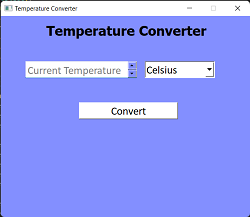
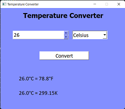

## Temperature Converter 

This project implements a temperature converter application using PyQt5. It allows users to enter a temperature value and select the original unit (Celsius, Fahrenheit, or Kelvin). The program then converts the temperature to the other two scales and displays the results.

### **Features:**

* User-friendly graphical interface.
* Supports conversion between Celsius, Fahrenheit, and Kelvin.
* Handles empty temperature input gracefully.

### **Getting Started:**

1. Ensure you have Python 3 and PyQt5 installed.
2. Clone or download this repository.
3. Run the application using `python TemperatureConverter.py`.

### **Instructions:**

1. Enter the temperature value in the text box.
2. Select the original unit of measurement from the dropdown menu.
3. Click the "Convert" button.
4. The converted temperatures in Celsius and Fahrenheit (or Kelvin) will be displayed below.

### **Bonus Features (for future development):**

* Implement error handling for invalid temperature values (e.g., non-numeric input).
* Allow users to choose the desired output units.
* Enhance the user interface with additional visual elements.

### **Code Structure:**

* `TemperatureConverter.py`: Entry point for the application. 
* `ui_temperature_converter.py`: Generated code for the user interface (Qt Designer).

### **Screenshots**

* <u> **Main Window:** </u> This image shows the graphical user interface of the temperature converter application.
    

* <u> **Example Celsius Conversion:** </u>  This image demonstrates an example of entering a temperature value in Celsius and displaying the converted values.
    

### **Feel free to modify and extend this code to personalize your temperature converter!**
